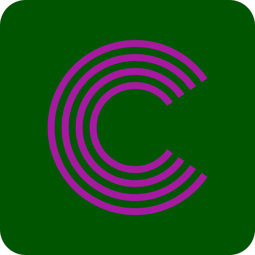

<!-- Improved compatibility of back to top link: See: https://github.com/Black-Catt/cocktails/ -->
<a name="readme-top"></a>


[![Contributors][contributors-shield]][contributors-url]
[![Forks][forks-shield]][forks-url]
[![Stargazers][stars-shield]][stars-url]
[![Issues][issues-shield]][issues-url]


<!-- PROJECT LOGO -->
<br />
<div align="center">
  <a href="https://github.com/Black-Catt/cocktails">
    
  </a>

  <h3 align="center">prometheus-x-course-task</h3>

 
</div>


<!-- TABLE OF CONTENTS -->
<details>
  <summary>Table of Contents</summary>
  <ul>
    <li>
      <a href="#about-the-project">About The Project</a>
      <ul>
        <li><a href="#built-with">Built With</a></li>
      </ul>
    </li>
    <li>
      <ul>
        <li><a href="#installation">Installation</a></li>
      </ul>
    </li>
    <li><a href="#contributing">Contributing</a></li>
    <li><a href="#contact">Contact</a></li>
  </ul>
</details>


<!-- ABOUT THE PROJECT -->
## About The Project


My project is a website that offers  cocktails and their corresponding ingredients. 
Users can search for specific cocktails or browse through various categories to discover new drinks.
Each cocktail page provides information about the ingredients needed, as well as step-by-step instructions on how to make the drink. 
This website serves as a convenient resource for anyone looking to try new cocktails or learn more about mixology

<p align="right">(<a href="#readme-top">back to top</a>)</p>


### Built With


* 
* 
* 
* [![React][React.js]][React-url]
* 
<p align="right">(<a href="#readme-top">back to top</a>)</p>


### Installation

1. Clone the repo
   ```sh
   git clone https://github.com/Black-Catt/cocktails.git
   ```
2. Install NPM packages
   ```sh
   npm install
   ```
<p align="right">(<a href="#readme-top">back to top</a>)</p>


<!-- CONTRIBUTING -->
## Contributing

Contributions are what make the open source community such an amazing place to learn, inspire, and create. Any contributions you make are **greatly appreciated**.

If you have a suggestion that would make this better, please fork the repo and create a pull request. You can also simply open an issue with the tag "enhancement".
Don't forget to give the project a star! Thanks again!

1. Fork the Project
2. Create your Feature Branch (`git checkout -b feature/AmazingFeature`)
3. Commit your Changes (`git commit -m 'Add some AmazingFeature'`)
4. Push to the Branch (`git push origin feature/AmazingFeature`)
5. Open a Pull Request

<p align="right">(<a href="#readme-top">back to top</a>)</p>


<!-- CONTACT -->
## Contact

Anton - zaharchenko3500@gmail.com


<p align="right">(<a href="#readme-top">back to top</a>)</p>


<!-- MARKDOWN LINKS & IMAGES -->
<!-- https://www.markdownguide.org/basic-syntax/#reference-style-links -->
[contributors-shield]: https://img.shields.io/github/contributors/Black-Catt/cocktails.svg?style=for-the-badge
[contributors-url]: https://github.com/Black-Catt/cocktails/graphs/contributors
[forks-shield]: https://img.shields.io/github/forks/Black-Catt/cocktails.svg?style=for-the-badge
[forks-url]: https://github.com/Black-Catt/cocktails/network/members
[stars-shield]: https://img.shields.io/github/stars/Black-Catt/cocktails.svg?style=for-the-badge
[stars-url]: https://github.com/Black-Catt/cocktails/stargazers
[issues-shield]: https://img.shields.io/github/issues/Black-Catt/cocktails.svg?style=for-the-badge
[issues-url]: https://github.com/Black-Catt/cocktails/issues
[product-screenshot]: images/screenshot.png
[React.js]: https://img.shields.io/badge/React-20232A?style=for-the-badge&logo=react&logoColor=61DAFB
[React-url]: https://reactjs.org/
